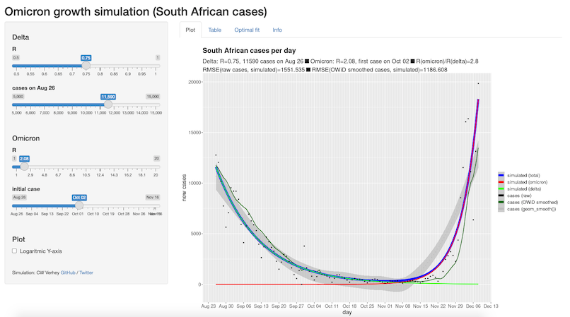
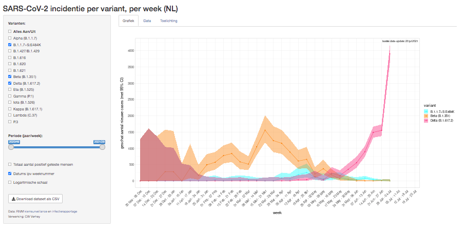
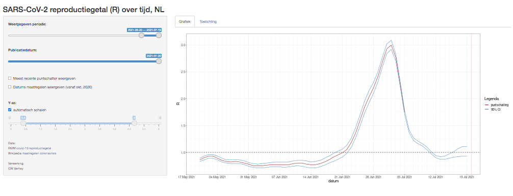
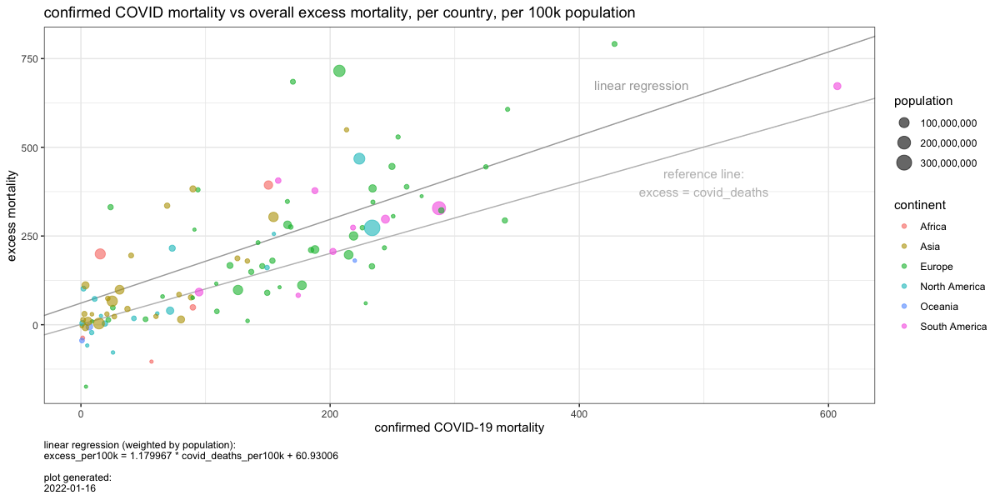

# COVID-19 analyses and other things

## [omicron growth in South Africa](omicron_SA)

Simulation app to estimate R-values for Delta and Omicron, based on total confirmed SARS-CoV-2 cases in South Africa. This app allows estimate the current R values per variant and to get a grasp of the (un)reliabilities in these estimations.
            
The best fitting parameter values are updated each day, and set as the default values when loading the app. They are also visible on the 'Optimal fit' tab.

See it live: https://cwverhey.shinyapps.io/omicron_SA

## [SARS-CoV-2 variants NL](SARS-CoV-2_variantsNL)

Analysis that derives the number of confirmed SARS-CoV-2 cases in the Netherlands per variant, based on overall confirmed cases and per-variant data from the RIVM study samples. Displayed in an R Shiny app. Updated weekly.

See it live: https://cwverhey.shinyapps.io/SARS-CoV-2_variantsNL/

## [SARS-CoV-2 R NL](SARS-CoV-2_R_NL)

R Shiny app to display the estimates for the reproduction number in the Netherlands over time. The data is unedited from RIVM, but includes archived data to visualize the unreliability of the short-term 95% CI. Updated weekly.

See it live: https://cwverhey.shinyapps.io/R_NL/

## [Excess Mortality vs Confirmed COVID-19 Deaths](excess_mortality)

Comparison of excess mortality per country (mortality 2020/2021 compared to the respective monthly averages from 2015-2019) versus the number of confirmed COVID-19 deaths in the same period. Updated periodically.

## Older documents

### [Simulate Group Testing](sim_group_tests.R)

To increase PCR testing capacity in times of crisis, it's possible to combine samples and take a pooled test. However, samples can't be pooled indefinitely - aside from the possible impact on test sensitivity, there's also a significant amount of pooled tests that need to be repeated in smaller sets because a single patient in the pool turned out to be infected.

This R script `sim_group_tests.R` visualizes the effect of re-testing in a simple simulation. It was mentioned on an [interview/podcast by De Correspondent](https://pca.st/episode/bb1580b8-8f06-4cb8-a626-aacf4c74df08) with Ms. Rosanne Hertzberger :)

### [Mask](mask)

A PDF template for a face mask with filter holder. I'd recommend cutting the filters from microfiber vacuum cleaner bags.

### [Pueyo](Pueyo)

This folder contains the images that illustrated [my refutations on a Medium-post](https://medium.com/@casparverhey/while-the-general-conclusion-and-advice-are-pretty-sound-there-are-more-people-infected-than-we-e78557df6462) which (also) went viral in the early pandemic, by Tomas Pueyo.

### [IC capacity NL](IC%20capacity%20NL)

Projections of ICU capacity requirements and mortality for The Netherlands. MS Office Excel spreadsheet and graphs. Based on literature and comparison with Italy. Made during the early months of the pandemic, in order to gain a quantitative insight in what to expect. It was especially interesting to use when (random) people entertained the thought of gaining herd immunity by exposing the young, healthy population.
