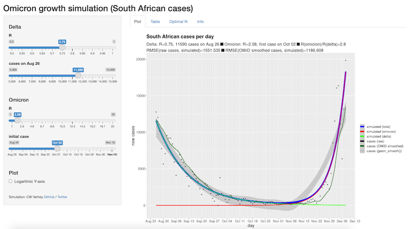

# omicron_SA
Simulation app to estimate R-values for Delta and Omicron, based on total confirmed SARS-CoV-2 cases in South Africa. Written in R Shiny.

## Use
The app is live here: https://cwverhey.shinyapps.io/omicron_SA/

## Purpose
The app simulates how many cases would be expected each day given current values for R(delta) and R(omicron) in South Africa, and the date of the initial Omicron patient. It also illustrates and quantifies the fit with real world data. This allows to get a grasp of the (un)reliabilities in current estimations of R values.
            
The best fitting parameter values are calculated automatically each day, and set as the default values when loading the app. They are also visible on the 'Optimal fit' tab.
            
At the time of writing (6 December), this simulation shows how uncertain the R of Omicron is; real-world cases will fit the model similarly over a vast range of R(omicron) values, as long as a suitable date for the first Omicron case is chosen. The later the initial omicron case, the higher R(omicron) needs to be.

The data is updated daily. The initial parameters are chosen for a (local) optimum fit. In the app, the 'Info' tab provides further information.

## Adapt

* `load_cache.R` must be run first to generate (or update) cached data; it stores case data from Our World In Data and the optimal simulation parameters in `omicron_SA.RData`. Set the directory that contains all files in the first line of`load_cache.R`.
* `app.R` runs the app, with shiny-server or RStudio.
* `functions.R` contains functions that are shared between both other R-files.